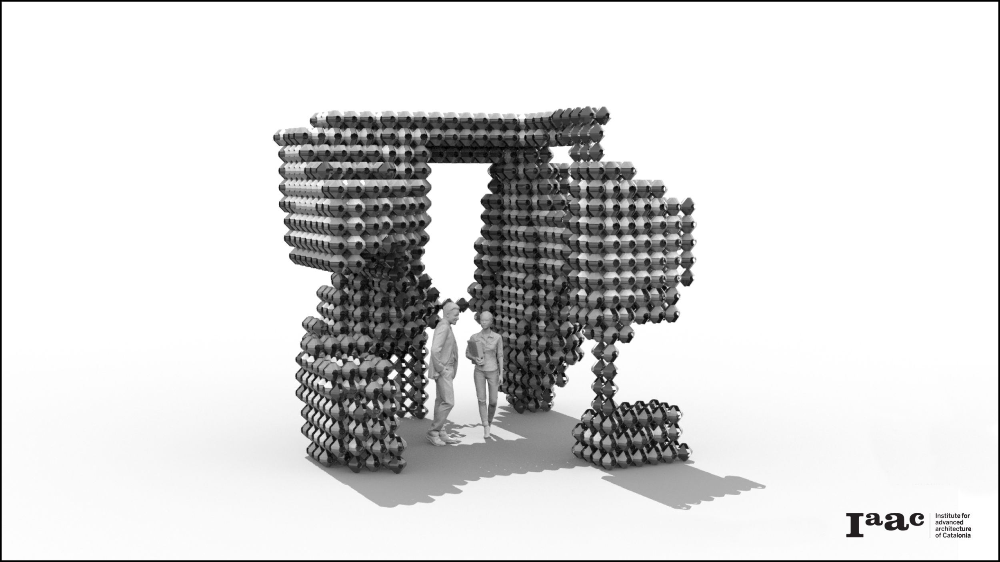
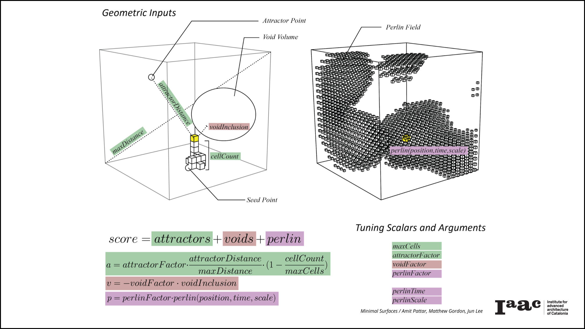

# g4_minimal_surfaces

This project creates voxelized aggregations of nested minimal-surface mesh modules following attractor fields.   
The bulk of the computation is defined in voxel_growth.py, while the surrounding grasshopper script is largely responsible for pulling geometry in from Rhino, and displaying and previewing the aggregations.

The basic input elements that are used for aggregation include several seed cells, from which additional cells will grow out from; one or more attractor points, which new cells will attempt to grow towards to various degrees; and one or more void volumes; that new cells will attempt to avoid. Finally, a perlin noise field is sampled to give additional variation locally, and in a more controlled manner than adding pure randomness. 
At every step, the program chooses a cell from the currently ‘live’ cells that have already been aggregated. The system chooses one of this cells six ‘neighbors’ in the X, Y, or Z axes in which to add a new module. This neighbor is chosen according to a score calculated from a the geometric elements mentioned, and user defined factors to define the relative strength of these elements on the outcome. 

The script automatically pulls all geometry in the layers points_seed, points_attractor, and volumes_void. When making updates to the tuning parameters or other parts of the python script, note that the py file is loaded behind a data dam. 

Minimal Surfaces is a project of IaaC, Institute for Advanced Architecture of Catalonia, Developed at Master in Robotics and Advanced Construction (MRAC) in 2019-2020 during Software I Seminar by:

Students: Matthew Gordon, Jun Lee, Amit Pattor

Faculty: Alessio Erioli, Eugenio Bettucchi
